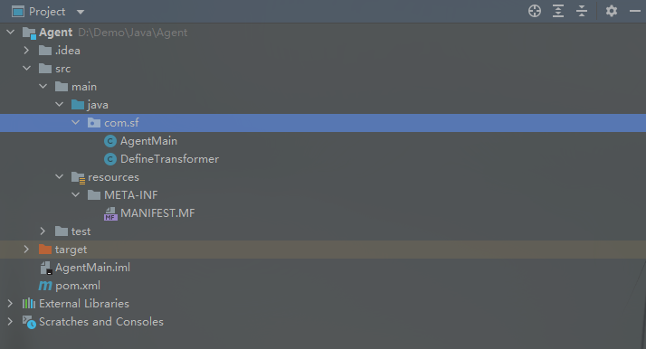
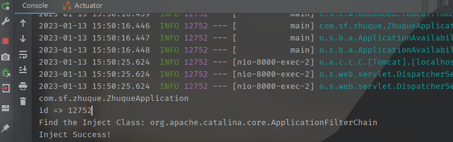

# AgentShell
源码参考：https://github.com/KpLi0rn/AgentMemShell

注意在打包前可以先进行`mvn clean`清理下缓存，然后执行`mvn assembly:assembly`进行打包。

项目目录



注意`MANIFEST.MF`文件中`Agent-Class`的值，同时在`pom.xml`中同样有配置，如果不嫌麻烦可以自己尝试下哪个优先级比较高。

```
<manifestEntries>
	<Project-name>${project.name}</Project-name>
	<Project-version>${project.version}</Project-version>
	<Agent-Class>com.sf.AgentMain</Agent-Class>
    <Can-Redefine-Classes>true</Can-Redefine-Classes>
    <Can-Retransform-Classes>true</Can-Retransform-Classes>
</manifestEntries>
```

打包后的文件名：Agent-1.0-SNAPSHOT-jar-with-dependencies.jar

使用情况：


